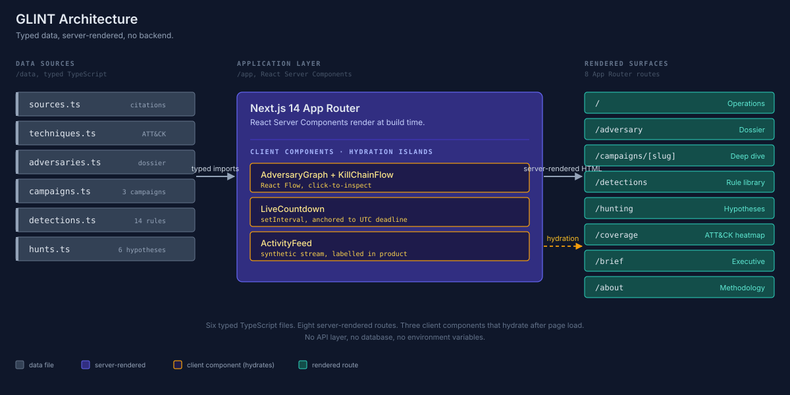

# GLINT

> An OSINT research project profiling the ShinyHunters / Scattered LAPSUS$ Hunters cluster, the three flagship campaigns they have run since 2024, and the detection rules and hunt hypotheses written against their documented tradecraft.

     

## What This Is

GLINT is an open-source intelligence (OSINT) research project focused on a single active threat actor cluster. The project monitors ShinyHunters / Scattered LAPSUS$ Hunters across primary reporting, structures what they have done into a coherent intel record, and translates their documented tradecraft into detection rules and hunt hypotheses that defenders can use.

The model is the same one used by professional threat intel teams at CrowdStrike Counter Adversary Operations, Mandiant, and Recorded Future: pick an adversary, watch them, write it down, build detections against their techniques. GLINT is the single-actor, single-analyst version of that work, with every claim cited to a primary source.

## Why ShinyHunters

ShinyHunters has been one of the most active financially motivated eCrime clusters of the past three years. Their campaigns demonstrate the modern attacker pattern that CrowdStrike's 2026 Global Threat Report calls "log in, don't break in": valid credentials, OAuth abuse, SaaS-layer exfiltration, and extortion without ransomware. Three campaigns alone, since 2024, account for hundreds of victim organisations and over 1.7 billion compromised records:

- 2024: Snowflake credential stuffing (UNC5537). Approximately 165 customer tenants compromised.
- 2025: Salesloft Drift OAuth supply chain (UNC6395). Approximately 760 Salesforce orgs, around 1.5 billion records.
- 2026: Active Canvas / Instructure extortion. Approximately 275 million records, 8,809 institutions.

The cluster keeps operating. They are a useful subject for sustained intelligence work because the public reporting is rich enough to learn from, and they continue to evolve their tradecraft in real time. The home page of this application includes a live countdown to the current Canvas ransom deadline (May 12 2026) because the campaign is, as of this writing, ongoing.

## The Research

What the project produced:

- A structured dossier of the ShinyHunters cluster, including UNC aliases (UNC5537, UNC6040, UNC6395), known affiliates (Scattered Spider, Lapsus$), and named victims, all cited to primary reporting.
- Three campaign deep-dives with timelines, kill chains, and IOCs distinguished as observed vs. synthetic.
- 14 detection rules authored against documented TTPs, three of which are fully written in Sigma YAML, CrowdStrike Falcon LogScale CQL, and Splunk SPL.
- Six hunt hypotheses, each tied back to the cited reporting that motivates it.
- A MITRE ATT&CK coverage heatmap showing which techniques across the cluster's tradecraft have detection coverage.
- A citation registry of 42 sources spanning Mandiant, CrowdStrike, vendor disclosures (Instructure, Salesloft, Salesforce, Snowflake, AT&T 8-K), investigative journalism (Krebs, CNN, TechCrunch, The Record, Inside Higher Ed), Bitdefender, DataBreaches.net, and Wikipedia.

## The Application

The research is presented through a small static Next.js 14 application with no backend. The app is the delivery mechanism, not the project. Pages are rendered server-side from typed source files in `/data`. Three small client components handle interactive elements: the React Flow graphs, the live countdown to the current extortion deadline, and the synthetic activity feed.

Every page reads from `/data`. There is no fetch boundary.

| Route | Purpose |
|---|---|
| `/` | Operations dashboard. Live countdown to the Canvas deadline, three CrowdStrike threat indicators (each cited), three tracked campaigns, detection coverage strip, synthetic activity feed in the right rail. |
| `/adversary` | ShinyHunters dossier. React Flow topology of the cluster with named UNC aliases, affiliates, and victims. Click any node to inspect. |
| `/campaigns/[slug]` | Per-campaign deep dive. Six- or seven-stage kill chain rendered horizontally in React Flow, side panel that updates as you click stages, vertical timeline, IOC table with synthetic vs. observed marking, and a source list. |
| `/detections` | Detection rule library. Searchable, filterable by severity and status. Each rule's detail panel shows Sigma YAML, Falcon LogScale CQL, and Splunk SPL forms when authored, plus a provenance card. |
| `/hunting` | Six hunt hypotheses. Each has rationale, query pseudocode, expected output, triage steps, MITRE coverage, and the source citations that motivated it. |
| `/coverage` | MITRE ATT&CK heatmap. Tactics as columns, techniques as cells, colored by the status of the matching detection. |
| `/brief` | Single-page executive summary. Printable, anchored to today's date. |
| `/about` | Methodology, data provenance section, and the full citation registry grouped by source type. |

## Architecture

The application is intentionally simple. The value of GLINT is the research it presents, not the platform that serves it.



The data layer is six typed TypeScript files. `sources.ts` is the citation registry referenced by every other file. Server components import what they need and render the eight routes at build time. Three client components hydrate after page load for interactivity: the React Flow graphs (`AdversaryGraph` and `KillChainFlow`), the `LiveCountdown` anchored to the Canvas deadline, and the synthetic `ActivityFeed`. No API layer, no database, no environment variables.

## The Three Campaigns

### Snowflake C5537 (2024)

UNC5537 replayed years of accumulated infostealer credentials against Snowflake customer tenants that did not enforce MFA. Approximately 165 organisations were compromised. AT&T, Ticketmaster, Santander, Advance Auto Parts, and LendingTree were publicly confirmed. The campaign drove Snowflake to mandate MFA on new accounts. Cited via Mandiant, Snowflake, AT&T 8-K, Krebs on Security.

### Salesloft Drift OAuth (2025)

UNC6395 found OAuth refresh tokens for the Drift Salesforce Connected App in a public Salesloft GitHub repo. They replayed those tokens against approximately 760 customer Salesforce orgs via the Bulk API. Around 1.5 billion records were claimed. Cloudflare, Palo Alto Networks, Zscaler, and Tenable were named. The actor never touched Salesloft's production environment. The customer trust boundary broke at the OAuth layer. Cited via Mandiant, Salesloft, Salesforce, Truffle Security, and The Record.

### Canvas Extortion (active, 2026)

On April 29 2026, Instructure detected a compromise of its Canvas LMS. The company publicly confirmed the incident on May 1, and ShinyHunters claimed responsibility on May 3 via the Scattered LAPSUS$ Hunters Telegram channel. Instructure attributed initial access to an exploited issue in the Canvas Free-For-Teacher account program and permanently shut that program down as part of the remediation. The breach exposed names, email addresses, student IDs, and some private messages between students and teachers across approximately 275 million records and 3.65 TB total, affecting 8,809 institutions including Harvard, Princeton, Columbia, UPenn, Georgetown, ASU, the University of Washington, the UC system, and multiple Australian universities. The first ransom deadline of May 6 was extended to May 12 after public pressure. On May 7 the actor defaced login pages at affected institutions in a second incident. Cited via Instructure, CNN, TechCrunch, Inside Higher Ed, Bitdefender, DataBreaches.net, Harvard Crimson, and Wikipedia.

## The Detections

GLINT ships 14 detection rules authored against the documented tradecraft of the three campaigns. Three are fully written in Sigma YAML, CrowdStrike Falcon LogScale CQL, and Splunk SPL. The remaining eleven carry full metadata (title, severity, ATT&CK mapping, log source, false-positive notes, and references) sufficient to populate the rule library and the coverage heatmap. All 14 are original research written against TTPs in the cited campaigns. The library is structured to accept adaptations from SigmaHQ, Splunk Security Content, and Elastic detection-rules in future iterations.

| ID | Title | Severity | ATT&CK | Status |
|---|---|---|---|---|
| det-salesforce-bulk-export | Salesforce Bulk API 2.0 Mass Export by Connected App | High | T1530, T1567 | Production |
| det-snowflake-new-asn-copy | Snowflake New-ASN Login Followed by External-Stage Unload | Critical | T1078, T1530, T1567 | Production |
| det-oauth-consent-non-corporate | OAuth App Consent Grant from Non-Corporate IdP | Critical | T1528, T1550.001 | Production |
| det-public-repo-secret | OAuth Token or API Key in Public-Repo Commit | High | T1552 | Production |
| det-vishing-helpdesk-reset | Helpdesk Password or MFA Reset Without Ticket | High | T1566.004, T1078 | Draft |
| det-snowflake-network-policy-change | Snowflake NETWORK_POLICY Modified by Non-Admin Source | High | T1078, T1556 | Draft |
| det-salesforce-connected-app-install | Connected App Installation Outside Change Window | High | T1528 | Draft |
| det-stealer-creds-corporate-domain | Corporate Email in Infostealer Marketplace | High | T1589.001, T1110.004 | Draft |
| det-bulk-api-job-non-mfa-session | Bulk API Job from Non-MFA Session | Medium | T1550.001, T1530 | Draft |
| det-canvas-impersonation-burst | Canvas Admin Impersonation Burst | High | T1078, T1530 | Draft |
| det-oauth-refresh-burst-new-asn | OAuth Refresh-Token Burst from New ASN | Critical | T1528, T1550.001 | Draft |
| det-egress-mega-fileio | Egress to Public File-Sharing Service | Medium | T1567 | Draft |
| det-stale-token-after-revocation | Connected App Activity After Mass Revocation | High | T1550.001 | Draft |

Every detection rule has a provenance card in its detail panel. Rules are labelled `Authored by GLINT detection engineering` or `Adapted from public detection library`. All 14 current rules are original research against documented ShinyHunters TTPs. The library is structured to accept adaptations from SigmaHQ, Splunk Security Content, and Elastic detection-rules in future iterations, with a `source_reference` URL field reserved for that.

The three fully built rules each ship with Sigma YAML, Falcon LogScale CQL, and Splunk SPL forms. The bulk export rule, for example, looks for records-processed counts that exceed a tunable threshold per Connected App and per 15-minute window, gated against a known-ETL allowlist to suppress noise from sanctioned integrations.

## Hunt Hypotheses

Six hunts on `/hunting`. Each one has a hypothesis, a rationale tied to the cited campaigns, query pseudocode, an expected-output shape, and a triage path.

| Hunt | Anchored to |
|---|---|
| Drift Connected App token replay from non-Drift ASNs | Salesloft Drift |
| Snowflake credentials in commercial infostealer marketplaces | Snowflake C5537 |
| Helpdesk identity action without a preceding ticket | UNC6040 vishing tradecraft |
| Connected App export volume exceeds its 90-day baseline | Salesloft Drift |
| Live verified secrets in public org-owned GitHub repositories | Salesloft Drift root cause |
| Canvas admin impersonation burst across institutional subaccounts | Canvas extortion |

Every hunt carries a `rationale_sources` array pointing at the cited reporting that motivates it, so a reviewer can walk from "why am I running this hunt?" back to "Mandiant published this technique here."

## Verified, Sourced, and Authored

The provenance discipline that runs through every claim in GLINT.

**Verified by primary reporting.** The three campaigns, their named victims, and the UNC labels (UNC5537, UNC6040, UNC6395) all cite Mandiant, vendor disclosures, or major news outlets. The 2026 Canvas facts of 8,809 institutions, 275 million records, 3.65 TB, the Free-For-Teacher vector, the deadline extension, and the login page defacement are sourced to CNN, TechCrunch, Inside Higher Ed, Bitdefender, DataBreaches.net, and Wikipedia.

**Authored by me, labelled as such.** All 14 detection rules and all 6 hunt hypotheses are original work written against the documented TTPs in the cited campaigns. Each rule and each hunt carries explicit provenance fields (`authored_by`, `rationale_sources`) and is surfaced in the UI on the rule's detail panel and the hunt's card. No detection rule is presented as if it were lifted from a published library when it was not.

**Flagged for manual audit.** Of 42 source entries in `/data/sources.ts`, 27 are flagged `needs_url_verification: true` because the publisher and headline are correct but I cannot guarantee the specific deep link resolves. 32 are flagged `needs_date_verification: true` where the exact publication date was a best-effort approximation. MITRE ATT&CK technique URLs are not flagged because the system-of-record pattern at attack.mitre.org is stable.

**Clearly synthetic.** The activity feed on the operations dashboard is a synthetic stream and labelled as such. Fabricated IOCs use obviously fake values (RFC 1918 addresses, .example domains) and are tagged SYNTHETIC in the UI. Real IOCs sourced from primary reporting are tagged OBSERVED.

The `/about` page has a Data Provenance section that explains all of this in product, so a reader who finds GLINT outside of GitHub sees the same disclosure.

## Run It Locally

GLINT runs locally with no backend, no env vars, no cloud account.

```bash
git clone https://github.com/abrar-sarwar/glint.git
cd glint
npm install
npm run dev
```

Open `http://localhost:3000`. The home page should show today's date and a live countdown to the Canvas deadline (May 12 2026, 23:59 UTC).

For a production build:

```bash
npm run build
npm run start
```

## What GLINT Is Not

GLINT is research, not a runtime. To be specific, it is not:

- A threat intelligence platform that ingests live IOC feeds
- A SIEM or detection runtime. The rules are authored but not connected to a log pipeline.
- A SOAR or case management tool
- A multi-actor coverage product. The focus is one cluster by design.
- A vulnerability or compliance reporting tool

If GLINT were extended into any of those, it would stop being focused research and become a different kind of project.

## Future Research

- Track the next ShinyHunters campaign as the cluster continues to operate, and publish a fourth campaign deep-dive.
- Adapt three or four detection rules from public Sigma repositories and label them `authored_by: "adapted_from"` to demonstrate the dual-provenance model with real adaptations.
- Complete the audit pass on the 27 URLs and 32 dates currently flagged `needs_url_verification` or `needs_date_verification` in `/data/sources.ts`.
- Expand the hunt library with hypotheses written against any new TTPs observed in subsequent campaigns.
- Optionally extend the methodology to a second cluster (Scattered Spider is the natural next subject) as a second research arc.

## Repository Layout

```
app/                        App Router pages and layouts
  layout.tsx                Root shell: sidebar + status bar
  page.tsx                  /  Operations dashboard
  adversary/page.tsx
  campaigns/[slug]/page.tsx
  detections/page.tsx
  hunting/page.tsx
  coverage/page.tsx
  brief/page.tsx
  about/page.tsx
  globals.css
components/
  shell/                    Sidebar, StatusBar
  ui/                       SeverityPill, MitreBadge, ConfidencePill, others
  graphs/                   AdversaryGraph, KillChainFlow
  home/                     Hero, StatCards, RecentCampaigns, CoverageStrip, ActivityFeed, LiveCountdown
  adversary/                AdversaryPanel
  campaign/                 CampaignDeepDive
  detections/               DetectionLibrary
data/
  sources.ts                Citation registry with verification flags
  techniques.ts             MITRE ATT&CK technique catalogue
  adversaries.ts            ShinyHunters dossier + relationship graph data
  campaigns.ts              Three flagship campaign objects
  detections.ts             14 detection rules with provenance
  hunts.ts                  6 hunt hypotheses with provenance
lib/
  utils.ts                  cn, formatters, severity tokens, live countdown logic
```

## License

MIT.

## Author

Abrar Tahir Sarwar. [GitHub](https://github.com/abrar-sarwar) · [LinkedIn](https://www.linkedin.com/in/abrar-sarwar). Related project on the AWS detection-and-response side: [TripWire](https://github.com/abrar-sarwar/tripwire).
