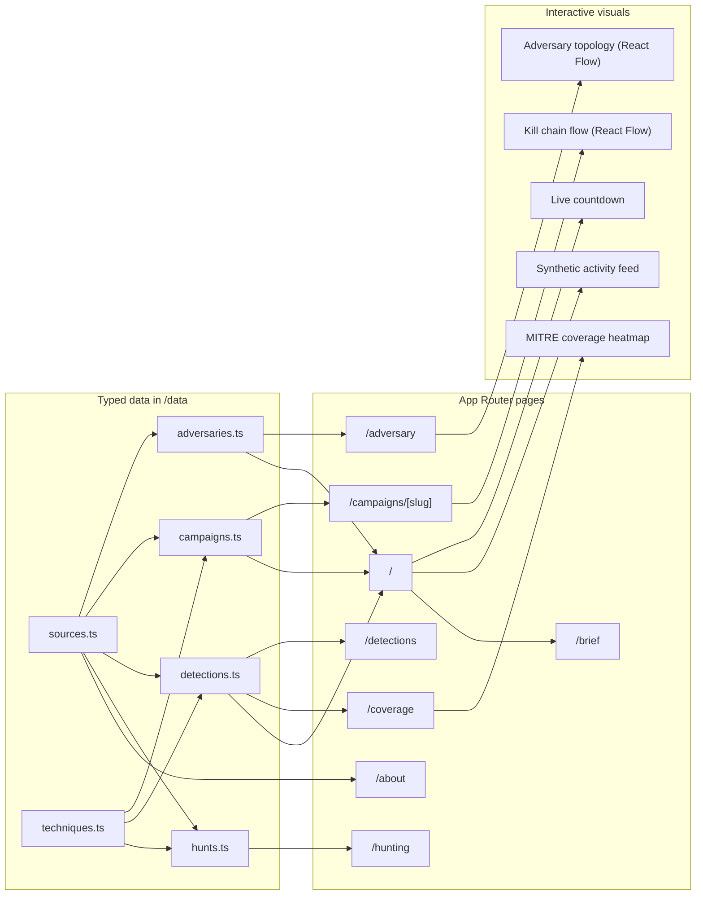

# GLINT

> Graph-Linked Intel for Network Threats. A focused, single-actor intel product that profiles the ShinyHunters cluster, the three flagship campaigns they have run since 2024, and the 14 detection rules that would catch them in your environment.

     

## The Problem

Open the average detection engineering Slack and you will find half a dozen vendor blogs, three news articles, two threat intel feeds, and one Mandiant PDF, all describing pieces of the same active campaign. Nobody on the team has a single structured view of what the adversary is doing right now, which of their techniques the team has coverage for, and which detection rules would close the gaps.

Commercial intel platforms like Mandiant Advantage and CrowdStrike Falcon Intelligence solve this. They also cost six figures a year. Small teams, contractors, and individual analysts end up with browser tabs instead of intel.

GLINT is the small, focused version. One cluster. Three campaigns. A real detection library. Every claim cites a primary source. Today is anchored to the actual clock, so the live countdown to the current extortion deadline updates in real time.

## What GLINT Does

- Profiles the ShinyHunters / Scattered LAPSUS$ Hunters cluster across three flagship campaigns: Snowflake C5537 in 2024, Salesloft Drift OAuth supply chain in 2025, and the active Canvas extortion in 2026.
- Ships 14 detection rules. Three are fully authored in Sigma YAML, CrowdStrike Falcon LogScale CQL, and Splunk SPL. Every rule is mapped to MITRE ATT&CK techniques and the campaigns that exercise them.
- Renders a MITRE ATT&CK coverage heatmap colored by detection status (production, draft, none).
- Visualizes the adversary cluster topology and the per-campaign kill chains as interactive React Flow graphs.
- Anchors every campaign, named victim, and statistic to a cited primary source. Synthetic IOCs are clearly labelled. Source URLs that need manual audit are flagged in the data.

## Architecture

GLINT is a static Next.js 14 application with no backend. Typed data lives in `/data` and is rendered through React Server Components. Three small client components handle the interactive bits: the React Flow graphs, the live countdown, and the synthetic activity feed.



Data flows in one direction. Typed source files are imported by server components, which assemble page output and pass slices into a handful of client components for interactive rendering. There is no API layer, no database, and no environment variable to configure.

## The Surfaces

Every page reads from `/data`. There is no fetch boundary.

| Route | Purpose |
|---|---|
| `/` | Operations dashboard. Live countdown to the Canvas deadline, three CrowdStrike threat indicators (each cited), three tracked campaigns, detection coverage strip, synthetic activity feed in the right rail. |
| `/adversary` | ShinyHunters dossier. React Flow topology of the cluster with named UNC aliases, affiliates, and victims. Click any node to inspect. |
| `/campaigns/[slug]` | Per-campaign deep dive. Six- or seven-stage kill chain rendered horizontally in React Flow, side panel that updates as you click stages, vertical timeline, IOC table with synthetic vs. observed marking, and a source list. |
| `/detections` | Detection rule library. Searchable, filterable by severity and status. Each rule's detail panel shows Sigma YAML, Falcon LogScale CQL, and Splunk SPL forms when authored, plus a provenance card. |
| `/hunting` | Six hunt hypotheses. Each has rationale, query pseudocode, expected output, triage steps, MITRE coverage, and the source citations that motivated it. |
| `/coverage` | MITRE ATT&CK heatmap. Tactics as columns, techniques as cells, colored by the status of the matching detection. |
| `/brief` | Single-page executive summary. Printable, anchored to today's date. |
| `/about` | Methodology, data provenance section, and the full citation registry grouped by source type. |

## The Three Campaigns

### Snowflake C5537 (2024)

UNC5537 replayed years of accumulated infostealer credentials against Snowflake customer tenants that did not enforce MFA. Approximately 165 organisations were compromised. AT&T, Ticketmaster, Santander, Advance Auto Parts, and LendingTree were publicly confirmed. The campaign drove Snowflake to mandate MFA on new accounts. Cited via Mandiant, Snowflake, AT&T 8-K, Krebs on Security.

### Salesloft Drift OAuth (2025)

UNC6395 found OAuth refresh tokens for the Drift Salesforce Connected App in a public Salesloft GitHub repo. They replayed those tokens against approximately 760 customer Salesforce orgs via the Bulk API. Around 1.5 billion records were claimed. Cloudflare, Palo Alto Networks, Zscaler, and Tenable were named. The actor never touched Salesloft's production environment. The customer trust boundary broke at the OAuth layer. Cited via Mandiant, Salesloft, Salesforce, Truffle Security, and The Record.

### Canvas Extortion (active, 2026)

On April 29 2026, Instructure detected a compromise of its Canvas LMS. The company publicly confirmed the incident on May 1, and ShinyHunters claimed responsibility on May 3 via the Scattered LAPSUS$ Hunters Telegram channel. Instructure attributed initial access to an exploited issue in the Canvas Free-For-Teacher account program and permanently shut that program down as part of the remediation. The breach exposed names, email addresses, student IDs, and some private messages between students and teachers across approximately 275 million records and 3.65 TB total, affecting 8,809 institutions including Harvard, Princeton, Columbia, UPenn, Georgetown, ASU, the University of Washington, the UC system, and multiple Australian universities. The first ransom deadline of May 6 was extended to May 12 after public pressure. On May 7 the actor defaced login pages at affected institutions in a second incident. Cited via Instructure, CNN, TechCrunch, Inside Higher Ed, Bitdefender, DataBreaches.net, Harvard Crimson, and Wikipedia.

## The Detections

14 rules across the kill chain. Three are fully authored in all three formats. The remainder are stubbed with metadata sufficient to populate the rule library and the coverage heatmap.

| ID | Title | Severity | ATT&CK | Status |
|---|---|---|---|---|
| det-salesforce-bulk-export | Salesforce Bulk API 2.0 Mass Export by Connected App | High | T1530, T1567 | Production |
| det-snowflake-new-asn-copy | Snowflake New-ASN Login Followed by External-Stage Unload | Critical | T1078, T1530, T1567 | Production |
| det-oauth-consent-non-corporate | OAuth App Consent Grant from Non-Corporate IdP | Critical | T1528, T1550.001 | Production |
| det-public-repo-secret | OAuth Token or API Key in Public-Repo Commit | High | T1552 | Production |
| det-vishing-helpdesk-reset | Helpdesk Password or MFA Reset Without Ticket | High | T1566.004, T1078 | Draft |
| det-snowflake-network-policy-change | Snowflake NETWORK_POLICY Modified by Non-Admin Source | High | T1078, T1556 | Draft |
| det-salesforce-connected-app-install | Connected App Installation Outside Change Window | High | T1528 | Draft |
| det-stealer-creds-corporate-domain | Corporate Email in Infostealer Marketplace | High | T1589.001, T1110.004 | Draft |
| det-bulk-api-job-non-mfa-session | Bulk API Job from Non-MFA Session | Medium | T1550.001, T1530 | Draft |
| det-canvas-impersonation-burst | Canvas Admin Impersonation Burst | High | T1078, T1530 | Draft |
| det-oauth-refresh-burst-new-asn | OAuth Refresh-Token Burst from New ASN | Critical | T1528, T1550.001 | Draft |
| det-egress-mega-fileio | Egress to Public File-Sharing Service | Medium | T1567 | Draft |
| det-stale-token-after-revocation | Connected App Activity After Mass Revocation | High | T1550.001 | Draft |

Every detection rule has a provenance card in its detail panel. Rules are labelled `Authored by GLINT detection engineering` or `Adapted from public detection library`. All 14 current rules are original research against documented ShinyHunters TTPs. The library is structured to accept adaptations from SigmaHQ, Splunk Security Content, and Elastic detection-rules in future iterations, with a `source_reference` URL field reserved for that.

The three fully built rules each ship with Sigma YAML, Falcon LogScale CQL, and Splunk SPL forms. The bulk export rule, for example, looks for records-processed counts that exceed a tunable threshold per Connected App and per 15-minute window, gated against a known-ETL allowlist to suppress noise from sanctioned integrations.

## Hunt Hypotheses

Six hunts on `/hunting`. Each one has a hypothesis, a rationale tied to the cited campaigns, query pseudocode, an expected-output shape, and a triage path.

| Hunt | Anchored to |
|---|---|
| Drift Connected App token replay from non-Drift ASNs | Salesloft Drift |
| Snowflake credentials in commercial infostealer marketplaces | Snowflake C5537 |
| Helpdesk identity action without a preceding ticket | UNC6040 vishing tradecraft |
| Connected App export volume exceeds its 90-day baseline | Salesloft Drift |
| Live verified secrets in public org-owned GitHub repositories | Salesloft Drift root cause |
| Canvas admin impersonation burst across institutional subaccounts | Canvas extortion |

Every hunt carries a `rationale_sources` array pointing at the cited reporting that motivates it, so a reviewer can walk from "why am I running this hunt?" back to "Mandiant published this technique here."

## Verified, Sourced, and Authored

The hard distinction this product makes.

**Verified by primary reporting.** The three campaigns, their named victims, and the UNC labels (UNC5537, UNC6040, UNC6395) all cite Mandiant, vendor disclosures, or major news outlets. The 2026 Canvas facts of 8,809 institutions, 275 million records, 3.65 TB, the Free-For-Teacher vector, the deadline extension, and the login page defacement are sourced to CNN, TechCrunch, Inside Higher Ed, Bitdefender, DataBreaches.net, and Wikipedia.

**Authored by me, labelled as such.** All 14 detection rules and all 6 hunt hypotheses are original work written against the documented TTPs in the cited campaigns. Each rule and each hunt carries explicit provenance fields (`authored_by`, `rationale_sources`) and is surfaced in the UI on the rule's detail panel and the hunt's card. No detection rule is presented as if it were lifted from a published library when it was not.

**Flagged for manual audit.** Of 42 source entries in `/data/sources.ts`, 27 are flagged `needs_url_verification: true` because the publisher and headline are correct but I cannot guarantee the specific deep link resolves. 32 are flagged `needs_date_verification: true` where the exact publication date was a best-effort approximation. MITRE ATT&CK technique URLs are not flagged because the system-of-record pattern at attack.mitre.org is stable.

**Clearly synthetic.** The activity feed on the operations dashboard is a synthetic stream and labelled as such. Fabricated IOCs use obviously fake values (RFC 1918 addresses, .example domains) and are tagged SYNTHETIC in the UI. Real IOCs sourced from primary reporting are tagged OBSERVED.

The `/about` page has a Data Provenance section that explains all of this in product, so a reader who finds GLINT outside of GitHub sees the same disclosure.

## Deploy It Yourself

GLINT runs locally with no backend, no env vars, no cloud account.

```bash
git clone https://github.com/abrar-sarwar/glint.git
cd glint
npm install
npm run dev
```

Open `http://localhost:3000`. The home page should show today's date and a live countdown to the Canvas deadline (May 12 2026, 23:59 UTC).

For a production build:

```bash
npm run build
npm run start
```

For a deploy, GLINT works on any static-friendly host. Vercel, Netlify, and Cloudflare Pages all work on their free tiers with zero configuration.

## Cost

Free. The app is a static Next.js application. No managed services, no database, no API keys. The only ongoing cost is whatever your host charges to serve static traffic, and three of the major hosts charge nothing on the free tier.

## What GLINT Does Not Do

By design, GLINT is not:

- A TIP that ingests live IOC feeds.
- A SIEM or detection runtime. Rules are written but not connected to any pipeline.
- A SOAR or case management tool.
- A multi-actor coverage product. One cluster is the focus.
- A vulnerability or compliance reporting product.

Those are deliberate scope choices, not gaps. A focused product is the value.

## Future Work

- Wire the "Run hunt" button on `/hunting` to a real Splunk REST or Falcon LogScale API and surface the result inline.
- Adapt three or four rules from public Sigma repos and label them `authored_by: "adapted_from"` to demonstrate the dual-provenance model end to end.
- Add the next ShinyHunters campaign as the cluster continues to operate.
- Complete the audit pass on the 27 URLs and 32 dates currently flagged for verification.
- Optional: a small persistence layer so a deployer can pin a list of monitored brands and get alerts when those names appear in the live ingest.

## Repository Layout

```
app/                        App Router pages and layouts
  layout.tsx                Root shell: sidebar + status bar
  page.tsx                  /  Operations dashboard
  adversary/page.tsx
  campaigns/[slug]/page.tsx
  detections/page.tsx
  hunting/page.tsx
  coverage/page.tsx
  brief/page.tsx
  about/page.tsx
  globals.css
components/
  shell/                    Sidebar, StatusBar
  ui/                       SeverityPill, MitreBadge, ConfidencePill, others
  graphs/                   AdversaryGraph, KillChainFlow
  home/                     Hero, StatCards, RecentCampaigns, CoverageStrip, ActivityFeed, LiveCountdown
  adversary/                AdversaryPanel
  campaign/                 CampaignDeepDive
  detections/               DetectionLibrary
data/
  sources.ts                Citation registry with verification flags
  techniques.ts             MITRE ATT&CK technique catalogue
  adversaries.ts            ShinyHunters dossier + relationship graph data
  campaigns.ts              Three flagship campaign objects
  detections.ts             14 detection rules with provenance
  hunts.ts                  6 hunt hypotheses with provenance
lib/
  utils.ts                  cn, formatters, severity tokens, live countdown logic
```

## License

MIT.

## Author

Abrar Tahir Sarwar. [GitHub](https://github.com/abrar-sarwar) · [LinkedIn](https://www.linkedin.com/in/abrar-sarwar). Related project on the AWS detection-and-response side: [TripWire](https://github.com/abrar-sarwar/tripwire).
